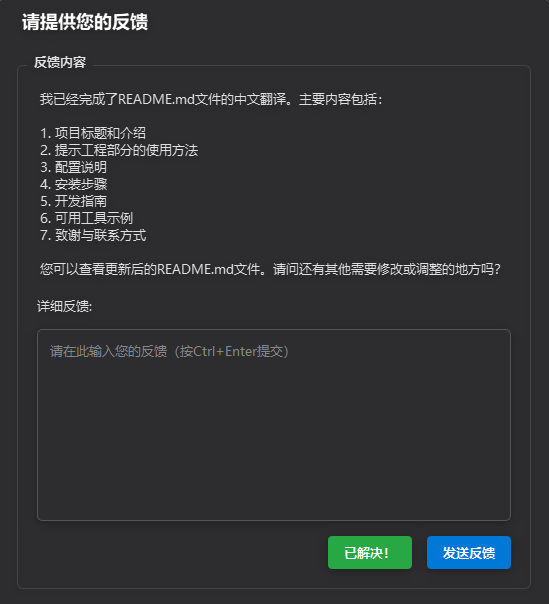

# 交互式反馈 MCP

由 Fábio Ferreira ([@fabiomlferreira](https://x.com/fabiomlferreira)) 开发。
查看 [dotcursorrules.com](https://dotcursorrules.com/) 获取更多 AI 开发增强工具。

这是一个简单的 [MCP 服务器](https://modelcontextprotocol.io/)，用于在 AI 辅助开发工具（如 [Cursor](https://www.cursor.com)）中实现人机协作工作流。该服务器允许您运行命令、查看输出结果，并直接向 AI 提供文本反馈。它还兼容 [Cline](https://cline.bot) 和 [Windsurf](https://windsurf.com)。



## 提示工程

为获得最佳效果，请将以下内容添加到 AI 助手的自定义提示中，您应该将其添加到规则中或直接添加到提示中（例如，Cursor）：

> 当您想要提问时，始终调用 MCP `interactive_feedback`。  
> 当您即将完成用户请求时，调用 MCP `interactive_feedback` 而不是简单地结束流程。
> 持续调用 MCP 直到用户的反馈为空，然后结束请求。

这将确保您的 AI 助手在将任务标记为已完成之前，使用此 MCP 服务器请求用户反馈。

## 💡 为什么使用它？
通过指导助手与用户确认而不是分散到推测性的高成本工具调用中，该模块可以大幅减少平台（如 Cursor）上的高级请求数量（例如，OpenAI 工具调用）。在某些情况下，它有助于将多达 25 个工具调用整合为单个具有反馈意识的请求 —— 节省资源并提高性能。

## 配置

此 MCP 服务器使用 Qt 的 `QSettings` 按项目存储配置。这包括：
*   要运行的命令。
*   是否在该项目的下次启动时自动执行命令（参见"在下次运行时自动执行"复选框）。
*   命令部分的可见状态（显示/隐藏）（这在切换时立即保存）。
*   窗口几何形状和状态（一般 UI 首选项）。

这些设置通常存储在特定于平台的位置（例如，Windows 上的注册表，macOS 上的 plist 文件，Linux 上的 `~/.config` 或 `~/.local/share` 中的配置文件），组织名称为 "FabioFerreira"，应用程序名称为 "InteractiveFeedbackMCP"，每个项目目录有一个唯一组。

UI 中的"保存配置"按钮主要保存当前输入到命令输入字段中的命令，以及活动项目的"在下次运行时自动执行"复选框的状态。命令部分的可见性在您切换时自动保存。窗口大小和位置在应用程序关闭时保存。

## 安装 (Cursor)


1.  **先决条件：**
    *   Python 3.11 或更新版本。
    *   [uv](https://github.com/astral-sh/uv) (Python 包管理器)。使用以下命令安装：
        *   Windows: `pip install uv`
        *   Linux/Mac: `curl -LsSf https://astral.sh/uv/install.sh | sh`
2.  **获取代码：**
    *   克隆此仓库：
        `git clone https://github.com/noopstudios/interactive-feedback-mcp.git`
    *   或下载源代码。
3.  **导航到目录：**
    *   `cd path/to/interactive-feedback-mcp`
4.  **安装依赖：**
    *   `uv sync` (这会创建一个虚拟环境并安装包)
5.  **运行 MCP 服务器：**
    *   `uv run server.py`
6.  **在 Cursor 中配置：**
    *   Cursor 通常允许在其设置中指定自定义 MCP 服务器。您需要将 Cursor 指向此运行中的服务器。具体机制可能有所不同，因此请参阅 Cursor 的文档以添加自定义 MCP。
    *   **手动配置（例如，通过 `mcp.json`）**
        **记得将 `/Users/fabioferreira/Dev/scripts/interactive-feedback-mcp` 路径更改为您系统上克隆仓库的实际路径。**

        ```json
        {
          "mcpServers": {
            "interactive-feedback-mcp": {
              "command": "uv",
              "args": [
                "--directory",
                "/Users/fabioferreira/Dev/scripts/interactive-feedback-mcp",
                "run",
                "server.py"
              ],
              "timeout": 600,
              "autoApprove": [
                "interactive_feedback"
              ]
            }
          }
        }
        ```
    *   在 Cursor 中配置时，您可以使用类似 `interactive-feedback-mcp` 的服务器标识符。

### 对于 Cline / Windsurf

适用类似的设置原则。您需要在相应工具的 MCP 设置中配置服务器命令（例如，带有正确的 `--directory` 参数指向项目目录的 `uv run server.py`），使用 `interactive-feedback-mcp` 作为服务器标识符。

## 开发

要在开发模式下运行带有 Web 界面进行测试的服务器：

```sh
uv run fastmcp dev server.py
```

这将打开一个 Web 界面，允许您与 MCP 工具交互进行测试。

## 可用工具

以下是 AI 助手如何调用 `interactive_feedback` 工具的示例：

```xml
<use_mcp_tool>
  <server_name>interactive-feedback-mcp</server_name>
  <tool_name>interactive_feedback</tool_name>
  <arguments>
    {
      "project_directory": "/path/to/your/project",
      "summary": "我已实现了您请求的更改并重构了主模块。"
    }
  </arguments>
</use_mcp_tool>
```

## 致谢与联系

如果您发现这个交互式反馈 MCP 有用，最好的表达感谢方式是在 [X @fabiomlferreira](https://x.com/fabiomlferreira) 上关注 Fábio Ferreira。

如有任何问题、建议，或者只是想分享您如何使用它，请随时在 X 上联系！

另外，查看 [dotcursorrules.com](https://dotcursorrules.com/) 获取更多关于增强 AI 辅助开发工作流的资源。